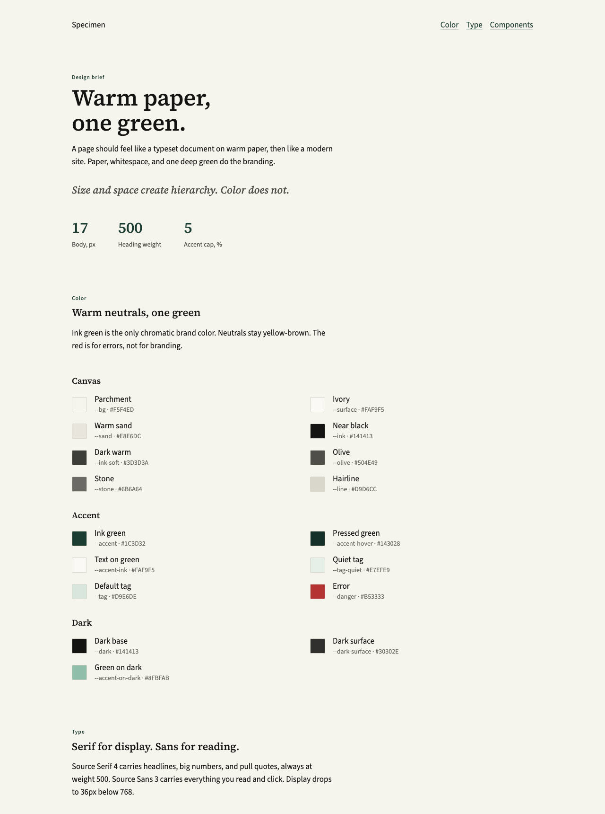

# dinsor-design

Warm paper, one green. Pages should read like a typeset document, then work like a site.

Source Serif 4 carries headlines, big numbers, and pull quotes. Source Sans 3 carries body text, navigation, and controls. The only chromatic brand color is ink green `#1C3D32`, and it stays rare. Surfaces are flat. Neutrals stay warm.



## Use it

```html
<link rel="stylesheet" href="dist/dinsor.css">
```

Plain CSS. No build step. Copy `dist/` and `fonts/` together.

## For coding agents

Start at [AGENTS.md](AGENTS.md). Then copy markup from [components/](components/) or start from [templates/page.html](templates/page.html). Check output with `node scripts/lint.mjs <files>`.

## Layout

| Path | What it is |
| --- | --- |
| [AGENTS.md](AGENTS.md) | Agent entry point: rules, read order, lint |
| [DESIGN.md](DESIGN.md) | Rationale and rules |
| [tokens/tokens.json](tokens/tokens.json) | Single source of every value |
| [src/](src/) | Authored CSS: fonts, base, components |
| [dist/](dist/) | Generated: `dinsor.css`, parts, `tokens.md`, Tailwind preset |
| [fonts/](fonts/) | woff2 files |
| [components/](components/) | Copy-paste markup, one file per component |
| [templates/](templates/) | Starter page |
| [scripts/](scripts/) | `build.mjs`, `lint.mjs` |
| [skills/](skills/) | Claude skill |
| [specimen/](specimen/index.html) | Visual reference |
| [examples/](examples/) | Demos built on the system. Not part of it |

## Change it

Edit `tokens/tokens.json` or `src/*.css`, run `npm run build`, commit `dist/`. CI runs `npm run check`.
