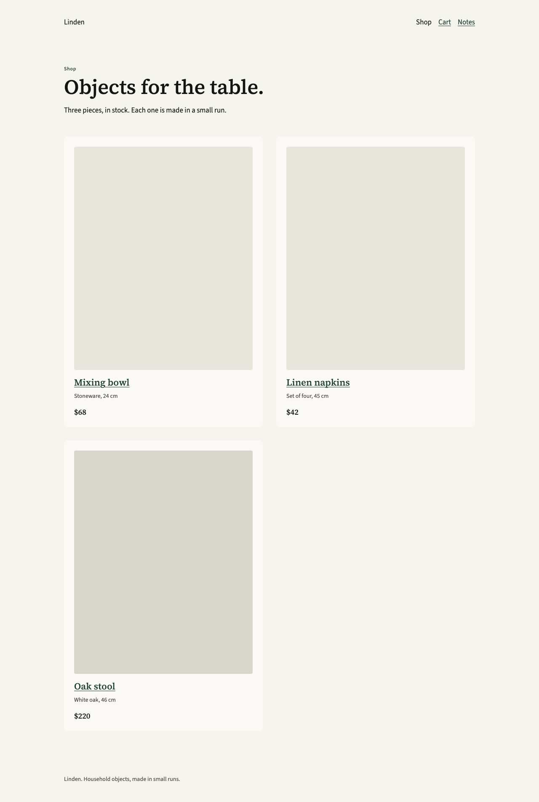
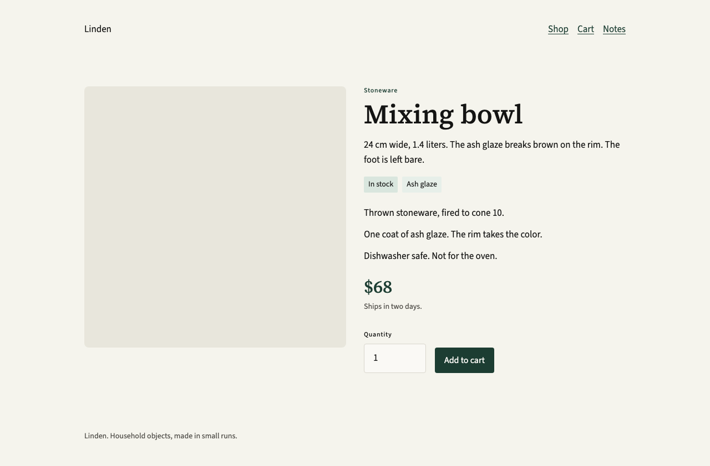
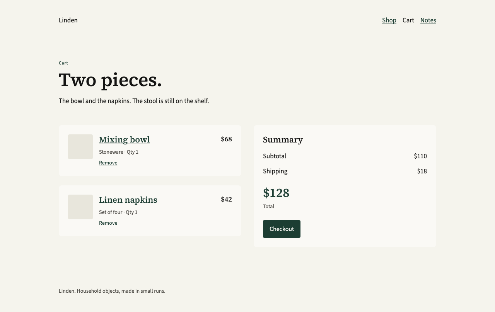

# dinsor-design

Warm paper, one green. Pages should read like a typeset document, then work like a site.

Source Serif 4 carries headlines, big numbers, and pull quotes. Source Sans 3 carries body text, navigation, and controls. The only chromatic brand color is ink green `#1C3D32`, and it stays rare. Surfaces are flat. Neutrals stay warm.

The rules for an implementation agent are in [DESIGN.md](DESIGN.md). Open [index.html](index.html) for the specimen.

## Sample shop

Linden is a household-goods shop built only from those rules. It has a catalog, product pages, a cart, checkout, an empty cart, an order receipt, and a short reading note.

Open [shop.html](shop.html). No build step.

## Pages

| File | What it is |
| --- | --- |
| [index.html](index.html) | Design specimen |
| [shop.html](shop.html) | Catalog |
| [product.html](product.html) | Mixing bowl |
| [napkins.html](napkins.html) | Linen napkins |
| [stool.html](stool.html) | Oak stool |
| [cart.html](cart.html) | Cart |
| [cart-empty.html](cart-empty.html) | Empty cart |
| [checkout.html](checkout.html) | Checkout |
| [order.html](order.html) | Order receipt |
| [story.html](story.html) | Reading note |
| [DESIGN.md](DESIGN.md) | Design rules |
| [site.css](site.css) | Shared shop styles |
